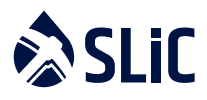

  

# 
Guide to Digital Asset Refining

## 
– Know Your Hashrate

Know Your Hashrate (https://www.knowyourhashrate.com/)

---
# Introduction
In our first paper “Guide to Digital Asset Refining – AML and implications for Hashrate” **1**, we covered the highlevel guidance from the Financial Action Task Force (FATF) and their global, binding standards to “prevent the misuse of virtual assets for anti-money laundering (AML) and terrorist financing”. We highlighted the opaque
nature of Hashrate and particularly the energy sources, geographic location of mining and information on the legal entity receiving Coinbase mining rewards.

The second paper shared further insights into the professional standards for Know Your Customer (KYC) policies and procedures, and their profound implications for Virtual Assets Service Providers (VASPs), as defined by the FATF, and the importance of the Travel Rule and new polices being released by domestic regulators and law
enforcement.

In this paper, we provide a guide to dealing with the opaque data surrounding Hashrate and a share a preliminary
Code of Conduct for the Mining industry - to improve operational procedures and move the Mining industry closer
to full compliance with accepted best practice.

# Know Your Hashrate
The Mining Industry creates little published data on underlying contributors to Hashrate, just publication of the Addresses receiving Coinbase. Furthermore, there are no standards to exchange information.

For VASPs the recently published messaging standards issued by interVASP’s Joint Working Group provides a model which provides some signposts for information interchange – something that is not even on the radar of secretive and ultra-competitive world of mining.

Two paradigms affect Miners **2**, and only one relates to VASPs and other Institutional participants:
• Open Loop use case, whereby Peer to Peer technology is connected to the traditional finance system;
• Closed Loop use case, where the original Peer to Peer vision of Satoshi Nakomoto results in Address to Address
transfers, that do not touch traditional financial architecture.

In the case of Open Loop systems, Miners are inevitably going be drawn into some form of regulation – this is the bargain required to integrate with the USD Trillions in fiat currency that flow every day in these mature systems.

In the case of Closed Loop Systems, it will likely be more of a voluntary movement, whereby educated participants start to question Coinbase provenance – although, realistically, this is likely to be a small minority of participants.

A voluntary disclosure of information, each time a Block is mined, would provide much needed data to satisfy the FATF that the Mining Industry is waking up to its obligations and taking positive steps to reduce the loopholes being exploited by Bad Actors. This is going to be a requirement for Miners in an Open Loop.

A suggested, entirely voluntary, data interchange file is being developed by the Information Technology team in SLiC, using insights from the XML or REST standards from the International Standards Organization (ISO) and Digital Asset standards such as interVASP (IVMS101 - https://intervasp.org/).

Representational state transfer (REST) that does not require XML, is simpler and provides protection against poorly configured XML, resulting in less complicated data formats like JSON.

This reporting standard (**Mining KYH Standard 42** - https://github.com/bitcoin-kyh) is being reviewed with Open Source collaboration and distribution planned in October 2020. In principle the following (BTC only) data items will be included in the design:

To identify the specific Block where **COINBASE (Newly Generated Coins)** is added to the Public or Private Mining

Pool Address:
- Height
- Timestamp
- Miner
- Hash
- Address
- Block Reward
- Fee Reward

The following meta-data can be published and linked to the COINBASE (Newly Generated Coins) data on the BTC Blockchain:

Per Miner in the Pool:
- Required
- Account
- Sub Account
- Mining URL
- KYC Completed [Y/N]
- Legal Entity Identifier (LEI)
- Withdraw Address

Suggested, Phase II adoption
Carbon Content of Power [As an estimate]

NB: SLiC will post this data to KnowYourHashrate.com, but other miners may adopt a different venue/technique and distributed using IPFS

**Mining KYH Standard 42** will be published on GitHub in October 2020, and from there will be Open Sourced with forked developments evolving as miners get to grips with this new voluntary, evolving standard.

# Preliminary KYH Code of Conduct
To improve operational procedures, and move the Mining industry closer to full compliance with generally accepted best practice, a voluntary Code of Conduct is shared below. This Code of Conduct is released as an Open Source artifact on GitHub and will evolve from a high level set of principles, to a mature Code of Conduct when the
peer review has been completed:

>Policy elements:
>- Principle 1: Wind down the practice of anonymity for mining registration within twelve months, with December 2021 as the deadline for compliance.
>- Principle 2: Collect generally accepted KYC data from third-party miners, as they relate to Mining Pool Country of Incorporation or the Mining Node used by Miners.
>- Principle 3: Share KYC data when requested by Law Enforcement or National / Federal Courts.
>- Principle 4: Adopt or fork **Mining KYH Standard 42** and publish via KnowYourHashrate.com or other data interchange platforms .i.e InterPlanetary File System (IPFS). IPFS is built around a decentralized system of user-operators who hold a portion of the overall data, creating a resilient system of file storage and sharing.
>- Principle 5: Launch an education program on the Mining Pool website about
>1. Why these changes are taking place;
>2. The increasing risk of criminal prosecution for non-compliance - especially for Open Loop integration.

# Community actions
With the FAFT ready to report again in twelve months, these voluntary policies may help to steer international bodies towards a convention that is practical and effective.

# Authors
- **Ian Gilmour**, COO SLiC International Ltd. Ian joined SLiC in late 2019 and has a banking and consulting background, with previous employers including HSBC, Deutsche Bank, Standard Chartered, PwC and IBM.
- **Thibault Verbiest**, Adjunct Professor SKEMA, Previously Head of Regulatory Affairs at Diginex and Member of the Executive Committee at SLiC International Ltd. Thibault has a LLM with the Universite libre de Bruxelles and LLM in International Media Law at the University of San Diego.
- **William Santiago**, CIO SLiC International Ltd. William joined SLiC in early 2020 and has worked as a software engineer and technical leader for IBM and was a cyber-security and Blockchain specialist at the Central Bank of Curacao.

1. https://medium.com/@slic_intl/guide-to-digital-asset-refining-aml-and-implications-for-hashrate-fe3069b2298f
2. This is a term attributed to Chip Poncy, K2 FIN, see CoinTelegraph article by Kirill Bryanov “Slow but Steady: FATF Review Highlights Crypto Exchanges Struggle to meet AML standards”
